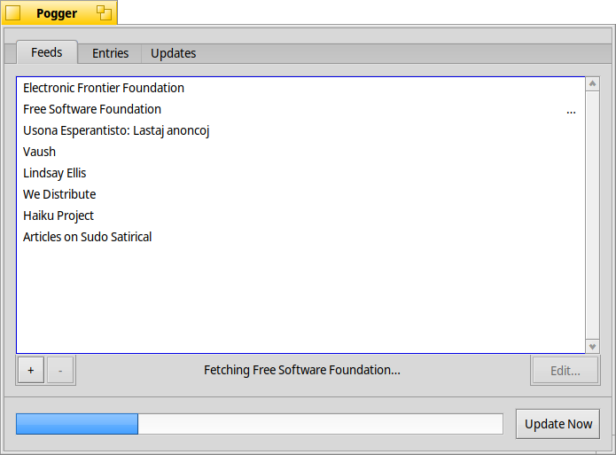
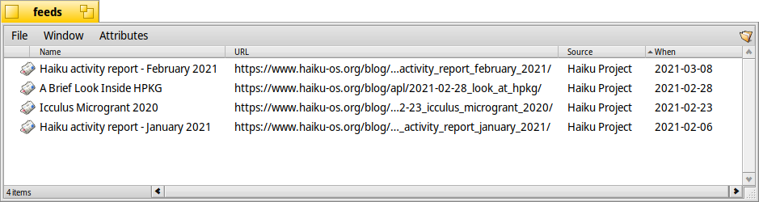

# Pogger
A simple RSS/Atom feed aggregator for Haiku.

Pogger works vaguely similarly to the mail service― you configure it, add your subscriptions, and forget about it. New entries for your feeds will be dumped into your feeds folder.

It works best for news or blog feeds, podcasts and the sort work better on [BePodder](https://github.com/HaikuArchives/BePodder).

## Usage
Whenever a subscribed feed is updated, "feed entry" files are dumped into your feeds folder, /boot/home/feeds/ by default.  They have the attributes you might expect― URL of the entry, the title, source, time posted, etc. The file contains the contents of that entry, if any were provided.

It's recommended to use Pogger to open these files, instead of directly using a web-browser. This'll smooth out any incompatibilities and make sure entries are opened just how you like them― as the downloaded HTML, or as a URL.

By default, it will open entries as URLs with WebPositive.

### Feeds
In the "Feeds" tab you can manage your subscribed feeds, and see the progress of the current update. Feeds that failed to update are marked with an "X" in their row.

### Entries
In "Entries" you can change your feed folder and how Pogger will handle the opening of feed entries.

### Updates
In "Updates" you can toggle notifications and set the frequency of updates.

## Building

`$ make`

Uses netservices, and has TinyXML2 as a dependency.

## License
This project is under the MIT license.
